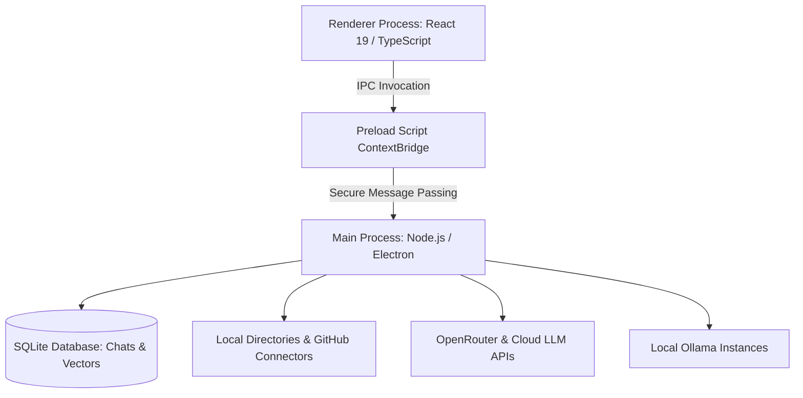
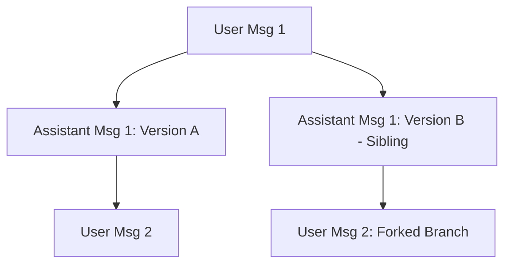

# Chatterbox: Architectural Specification & Implementation Plan

This document outlines the architecture, data schemas, user experience (UX) layout, and step-by-step implementation phases for **Chatterbox**, a desktop AI chat application built on Electron, React, and TypeScript.

---

## 1. System Architecture

Chatterbox uses Electron's multi-process model to separate the user interface (Renderer process) from system-level operations like local database storage, file tracking, and vector indexing (Main process).



### Main vs. Renderer Division of Labor
*   **Renderer Process (UI/UX)**:
    *   State management for active conversations, projects, and active panels.
    *   Rich text markdown rendering, syntax highlighting for code, and message rendering.
    *   Interactive sliders for sampler parameters and project configuration forms.
*   **Preload Script (Security Bridge)**:
    *   Exposes a restricted set of IPC methods (`chatterbox:api`, `chatterbox:db`, `chatterbox:fs`) to prevent arbitrary Node.js execution in the renderer.
*   **Main Process (Core & System Level)**:
    *   **Secure Storage**: Local config and LLM API keys encrypted using Electron’s safe storage API.
    *   **Data Storage**: SQLite (`better-sqlite3`) for persisting chat history, tree parent-child associations, and projects.
    *   **File Operations & RAG**: Text extraction, chunking, and vector index generation/search.
    *   **Provider Client**: Stream handler to proxy chat requests to OpenRouter, Anthropic, OpenAI, or local Ollama instances.

---

## 2. Core Features & User Flow Spec

### A. Sibling Messages & Thread Branching
If you regenerate/redo a request, the app saves the old response and appends the new one as a sibling.
*   **Hover Actions**: When the mouse hovers over an assistant card, a pagination indicator appears: `< 2 / 3 >`.
*   **Sibling Switcher**: Clicking the arrows swaps the message content with its siblings.
*   **Forking Threads**: The user can fork the conversation starting from any message. The selected message and its history up to that point are copied into a new chat thread, which appears nested under the original thread in the sidebar.



### B. Project Management & Connectors (Local RAG)
*   **Projects**: Workspaces containing multiple chats, connected folders, and repository links.
*   **Background Summarization**: When a chat within a project ends or goes idle, a background worker summarizes the discussion and stores it. Other chats in the project query these summaries during system prompts.
*   **Local RAG Ingestion**:
    *   Users connect local directories or GitHub repositories.
    *   A file watcher tracks additions and updates.
    *   Files are parsed, chunked (e.g., recursive text splitter, 500-character chunks with 10% overlap), and converted into vector embeddings using a local library (like `transformers.js` with `all-MiniLM-L6-v2`) or an external service.
    *   Before sending queries to the LLM, a cosine similarity search retrieves relevant file snippets and injects them into the model's context window.

---

## 3. Database Schema

The local database stores relational chat structures and vector data.

### `projects` Table
| Column | Type | Description |
| :--- | :--- | :--- |
| `id` | TEXT (PK) | Unique project identifier |
| `name` | TEXT | Display name |
| `summary` | TEXT | Automatically updated overall project summary |
| `created_at` | INTEGER | Epoch timestamp |

### `chats` Table
| Column | Type | Description |
| :--- | :--- | :--- |
| `id` | TEXT (PK) | Unique chat identifier |
| `project_id` | TEXT (FK) | Reference to owner project |
| `name` | TEXT | Chat title |
| `parent_id` | TEXT (FK) | Reference to parent chat if forked, otherwise NULL |
| `hidden` | INTEGER | Boolean (0 or 1) to toggle visibility |
| `created_at` | INTEGER | Epoch timestamp |

### `messages` Table
| Column | Type | Description |
| :--- | :--- | :--- |
| `id` | TEXT (PK) | Unique message identifier |
| `chat_id` | TEXT (FK) | Reference to owner chat |
| `sender` | TEXT | `'user'` or `'assistant'` |
| `content` | TEXT | The selected active content text |
| `created_at` | INTEGER | Epoch timestamp |

### `message_siblings` Table
Stores alternative outputs generated during retries.
| Column | Type | Description |
| :--- | :--- | :--- |
| `id` | TEXT (PK) | Unique identifier |
| `message_id` | TEXT (FK) | Reference to primary message card in `messages` |
| `content` | TEXT | Text content of this sibling version |
| `sibling_index` | INTEGER | Ordering index (0-indexed) |

---

## 4. UI Grid & Panel Spec

Chatterbox uses a responsive 3-column layout built with CSS flexbox and grid containers.

```
+-----------------------------------------------------------------------------------------------+
| LOGO & PROJECT SELECT  |  CHAT NAME (PROVIDER & MODEL SELECTION)       | CONFIGURATION TITLE  |
+------------------------+-----------------------------------------------+----------------------+
| CONVERSATION LIST      |  [ACTIVE TOOLS BADGES: SEARCH / RAG / CODE]   | SYSTEM PROMPT EDIT   |
| - Chat A               |  -------------------------------------------  | -------------------- |
|   - Fork A.1           |  User: How to construct RAG embeddings?       | SAMPLER SLIDERS      |
|   - Fork A.2           |                                               | - Temperature (0.7)  |
| - Chat B               |  Assistant (Claude 3.5):                      | - Max Tokens (4096)  |
|                        |  Here is the code... [ 2 / 3 ] 🔄 [Copy]       | - Top-P (0.9)        |
|                        |                                               |                      |
| PROJECT SUMMARY CARD   |  -------------------------------------------  | BATCH UTILITIES      |
| [🔌 Docs] [🔌 Repos]   |  User: [AttachmentImg.png] Explain this...    | - Select Messages    |
|                        |                                               | - Fork Selected      |
|                        |                                               | - Save Chat to File  |
+------------------------+-----------------------------------------------+----------------------+
| NEW PROJECT WORKSPACE  |  [+] [ Type your query...                 ] > | (SIDEBAR COLLAPSE)   |
+-----------------------------------------------------------------------------------------------+
```

---

## 5. Iterative Development Implementation Plan

This breakdown serves as an action plan for developers and agents to implement Chatterbox step-by-step.

### Phase 1: High-Fidelity UI Skeleton & Themes (Current State)
*   **Tasks**:
    *   Set up a dark-mode theme with glassmorphic panels and borders using HSL colors.
    *   Build responsive sidebars that can be expanded or collapsed.
    *   Create mock components for tree-views, sliders, file input previews, and tool badges.
    *   Incorporate local states to demonstrate message sibling switching, selection modes, and chat deletion/hiding.

### Phase 2: Native Storage & SQLite Integration
*   **Tasks**:
    *   Integrate `better-sqlite3` within the Electron main process.
    *   Create database schemas for projects, chats, messages, and siblings.
    *   Expose secure database operations to the renderer via IPC (`main/preload.ts`).
    *   Replace React memory state with SQLite persistence, loading threads and child forks dynamically on boot.

### Phase 3: Provider API Client & Streaming Connection
*   **Tasks**:
    *   Install `@openrouter/api` or set up standard streaming connection templates for OpenRouter, and custom fetch templates for Anthropic, and OpenAI.
    *   Implement secure API key configuration and encrypted disk storage (via Node `crypto` or Electron `safeStorage`).
    *   Configure IPC communication channels to stream assistant answers block-by-block.
    *   Implement user controls for toggling active provider, selecting models, and sending user messages with attachments.

### Phase 4: Sibling Management & Thread Branching Logic
*   **Tasks**:
    *   Implement the "Redo/Retry" action on assistant messages.
    *   Save regenerated responses into the `message_siblings` table and wire up the arrow navigation controls.
    *   Write database queries to fetch all siblings for a message on selection.
    *   Verify that navigation between message states updates the UI.

### Phase 5: Left Sidebar Tree View & Operations
*   **Tasks**:
    *   Create a tree-view listing component in the left sidebar that processes `parent_id` relationships.
    *   Ensure child forks render indented underneath their parent nodes.
    *   Add hover action triggers for deleting threads or toggling the `hidden` field.
    *   Implement collapsible/expandable states for nested thread trees.

### Phase 6: Right Sidebar Samplers & Selection Mode
*   **Tasks**:
    *   Connect right sidebar sliders to the API client parameters (Temperature, Max Tokens, Top-P, Presence Penalty).
    *   Wire the system prompt editor to the active chat's session metadata.
    *   Implement the selection mode workflow: toggling selection mode displays checkboxes next to chat messages.
    *   Configure batch operations: "Delete Selected" and "Fork Selected" (which clones the selected message range into a new child thread).

### Phase 7: Document Ingestion, Vectors & Local RAG
*   **Tasks**:
    *   Write Main Process functions to read local files, scrape directories, and connect to GitHub APIs.
    *   Implement document splitting and text chunking routines.
    *   Configure local vector embeddings generation using `transformers.js` or an API endpoint.
    *   Add a local index database (like SQLite with vector search extension or HNSWLib).
    *   Implement similarity search to retrieve relevant text chunks and inject them into LLM payloads.

### Phase 8: Cross-Chat Context Summarization
*   **Tasks**:
    *   Configure a background summarization agent that runs whenever a chat session is idle.
    *   Create an index of chat summaries grouped by project.
    *   Implement a retrieval tool that lets the active chat query summaries of past conversations.
    *   Perform performance testing, bundle build checks, and design adjustments.

---

> [!IMPORTANT]
> Keep the system security-focused. Never store API keys in plain text files or directly in the React frontend. Always store keys using Electron’s native secure keychain interfaces.
